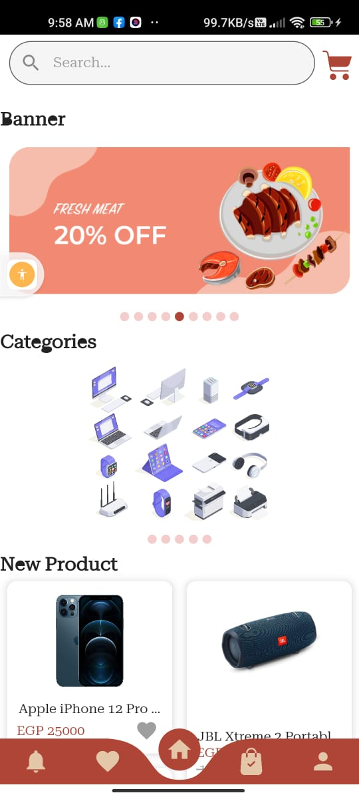
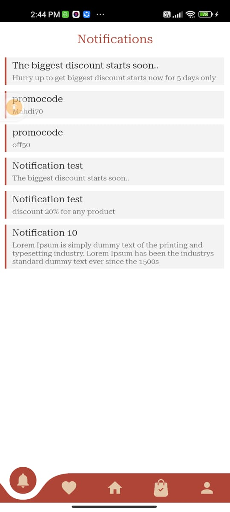
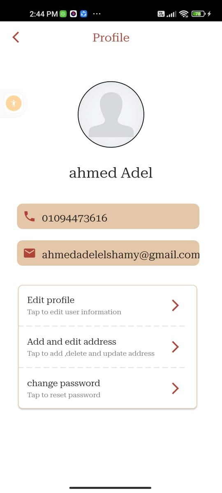

# flutter_shop_store
Shop store is the e-commerce application that show products.I applied all logic you can occurred on any commerce app such as cart items , filtering by price or product name , local favourite,local search,

Please star ⭐ the repo if you like what you see😉.

</img>
</img>
</img>
</img>
</img>
</img>
</img>
</img>
</img>
</img>
</img>
</img>
</img>

✨ Plugins and Concepts :
  

. Remote data from (https://student.valuxapps.com/api/) api source.

. Authenticate with email and password, email verification and forget password.

. Shimmer package to make custom loading animation.

Apis dio:
.
 json_annotation
:
. 
cached_network_image
:
  

 

Bloc:

✨ App Features :
  

.Native Splash screen.

.Search bar for searching about any product.

.Possibility to save favorite product.

